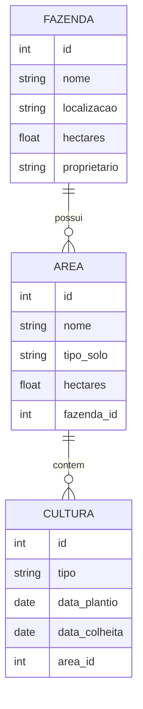

# 📊 Modelagem de Dados — ERP Agro

Este documento apresenta a modelagem inicial do banco de dados do ERP Agro, com foco nas entidades essenciais para o funcionamento dos primeiros módulos do sistema: **Fazendas**, **Áreas** e **Culturas**.

---

## 📐 Diagrama Entidade-Relacionamento (DER)

