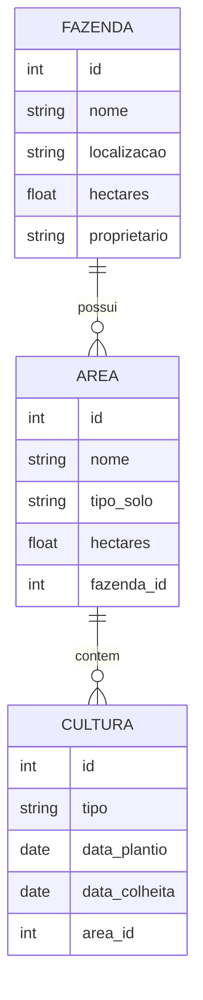

## üìê Diagrama Entidade-Relacionamento (DER)

```mermaid
erDiagram
    FAZENDA ||--o{ AREA : possui
    AREA ||--o{ CULTURA : contem

    FAZENDA {
        int id
        string nome
        string localizacao
        float hectares
        string proprietario
    }

    AREA {
        int id
        string nome
        string tipo_solo
        float hectares
        int fazenda_id
    }

    CULTURA {
        int id
        string tipo
        date data_plantio
        date data_colheita
        int area_id
    }
```
